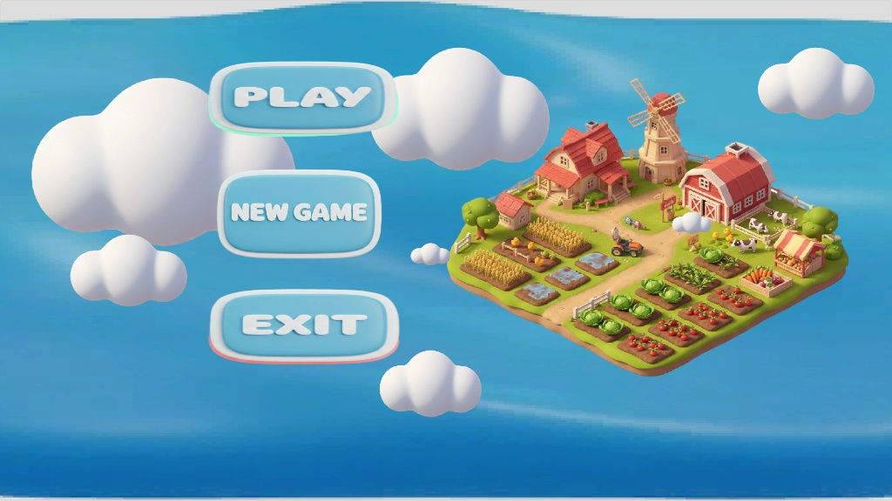

# 🏙️ ECOCITY - Sustainable City Builder


> **ECOCITY** là dự án game mô phỏng xây dựng thành phố 3D, tập trung vào việc cân bằng giữa phát triển kinh tế và bảo vệ môi trường. Dự án được phát triển nhằm mục đích học tập và nghiên cứu các hệ thống cốt lõi trong Unity.



## ✨ Tính Năng Nổi Bật (Key Features)

### 🏗️ Hệ thống Xây dựng (Grid-based Building System)
*   Cơ chế **Snap-to-grid** giúp đặt công trình thẳng hàng, ngay ngắn.
*   Sử dụng **Raycast** để phát hiện vị trí mặt đất từ Camera.
*   Kiểm tra tài nguyên trước khi xây dựng.

### 🌤️ Chu kỳ Ngày/Đêm Động (Dynamic Day/Night Cycle)
*   **Time System:** Hệ thống thời gian thực trôi trong game (0h - 24h).
*   **Dynamic Lighting:** Ánh sáng mặt trời (Directional Light) xoay theo thời gian thực.
*   **Ambient Control:** Màu sắc môi trường và Skybox thay đổi theo biểu đồ Gradient (Sáng -> Trưa -> Chiều -> Tối).
*   **Smart Street Lights:** Hệ thống đèn đường tự động bật/tắt khi trời tối/sáng (Tối ưu hiệu năng).

### 📊 Quản lý Tài nguyên & Dữ liệu (Economy & Data)
*   **ScriptableObjects:** Quản lý dữ liệu công trình (Giá tiền, Mức tiêu thụ điện, Chỉ số ô nhiễm) giúp dễ dàng cân bằng game mà không cần sửa code.
*   **Resource Manager:** Hệ thống kinh tế quản lý Tiền ($).

### 🎥 RTS Camera Controller
*   Điều khiển Camera theo phong cách game chiến thuật: Di chuyển (WASD), Zoom (Scroll), Pan.

---

## 🛠️ Công Nghệ & Kỹ Thuật (Tech Stack)

*   **Engine:** Unity 2022.3 (LTS).
*   **Render Pipeline:** Universal Render Pipeline (URP) cho hiệu năng tốt và ánh sáng đẹp.
*   **Design Patterns:**
    *   **Singleton:** Sử dụng cho các Manager (GameManager, BuildingManager, ResourceManager).
    *   **ScriptableObject Architecture:** Tách biệt dữ liệu (Data) và Logic.
*   **Version Control:** Git & Git LFS (Large File Storage).

---

## 🚀 Hướng Dẫn Cài Đặt (Installation)

Dự án sử dụng **Git LFS** để quản lý assets. Vui lòng đảm bảo bạn đã cài đặt Git LFS trước khi clone.

1.  **Clone repository:**
    ```bash
    git lfs install
    git clone https://github.com/USERNAME/ECOCITY.git
    ```

2.  **Mở bằng Unity Hub:**
    *   Mở Unity Hub -> Chọn **Add**.
    *   Trỏ tới thư mục `ECOCITY` vừa clone.
    *   *Khuyến nghị dùng Unity phiên bản 2022.3.x trở lên.*

3.  **Chạy Game:**
    *   Đợi Unity import assets (lần đầu sẽ mất vài phút).
    *   Vào thư mục `Assets/_Scenes`.
    *   Mở **MainMenuScene**.
    *   Nhấn nút ▶️ **Play**.

---

## 🎮 Điều Khiển (Controls)

| Phím / Thao tác | Chức năng |
| :--- | :--- |
| **W, A, S, D** | Di chuyển Camera (Pan) |
| **Con lăn chuột** | Phóng to / Thu nhỏ (Zoom) |
| **Chuột Trái** | Đặt công trình / Chọn UI |
| **Chuột Phải** | Hủy chọn công trình |

---

## 📂 Cấu Trúc Thư Mục (Project Structure)

```text
Assets/
├── _Scenes/           # Các màn chơi (Main Menu, Gameplay)
├── _Scripts/          # Source Code C#
│   ├── Managers/      # (GameManager, BuildingManager...)
│   ├── Controllers/   # (CameraController...)
│   ├── Setup/       # (DayNightCycle, Economy...)
│   └── Data/          # (ScriptableObjects definitions)
├── Prefabs/           # Các Object mẫu (Nhà, Cây, UI)
├── ScriptableObjects/ # Dữ liệu cấu hình Game (Building Stats)
├── Materials/         # URP Materials
└── Art/               # Models, Textures (Third-party assets)
```

---

## 🤝 Đóng góp (Contributing)

Mọi đóng góp đều được hoan nghênh! Nếu bạn muốn cải thiện dự án:

1.  Fork dự án này.
2.  Tạo nhánh tính năng mới (`git checkout -b feature/AmazingFeature`).
3.  Commit thay đổi (`git commit -m 'Add some AmazingFeature'`).
4.  Push lên nhánh (`git push origin feature/AmazingFeature`).
5.  Mở Pull Request.

---

## 📄 License

Dự án này được phân phối dưới giấy phép **MIT**. Xem file [LICENSE](LICENSE.md) để biết thêm chi tiết.

---

### Liên hệ
*   **Developer:** [VÕ TRẦN GIA HUY]
*   **Email:** [vtgh1602@gmail.com]
*   **Portfolio:** [https://www.linkedin.com/in/giahuy-votran-121b54395]